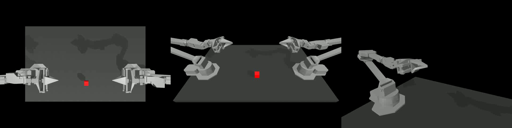
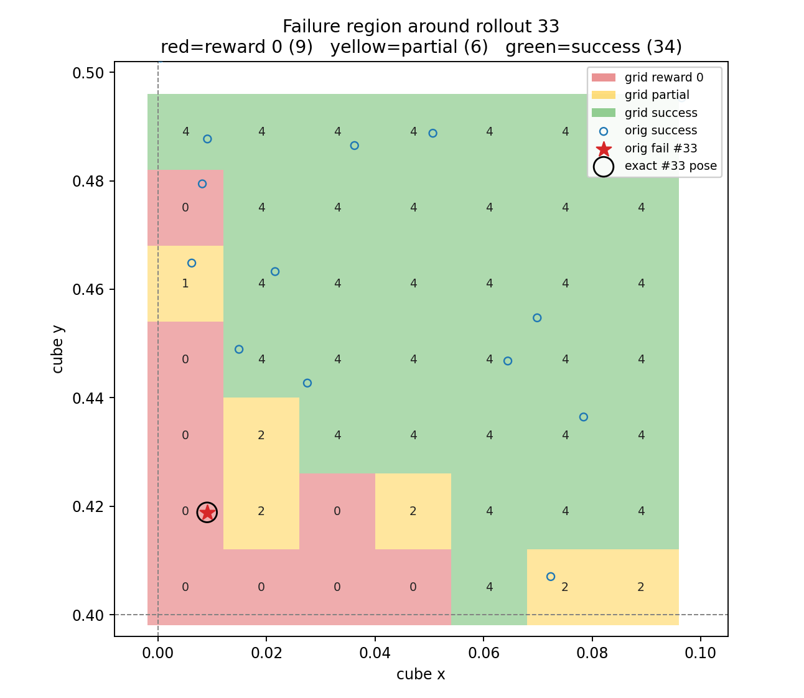

# 05 — Failure Analysis (Rollout 33)

Policy: \(k=100\) ACT, `policy_best.ckpt` under `ckpts/transfer_cube/`.  
Figures: [`figures/failure_region_map.png`](figures/failure_region_map.png), [`figures/cube_xy_scatter.png`](figures/cube_xy_scatter.png), [`figures/video33_frame0.png`](figures/video33_frame0.png).

---

## 1. Discovery in random evaluation

With **temporal aggregation**, 50 eval poses from `set_seed(1000)`:

| Metric | Value | Source |
|---|---|---|
| Success | 49/50 = 98% | `eval_temporal_agg/result_policy_best.txt` |
| Only failure | **rollout 33** | highest_reward = 0, return = 0 |

Without TA, rollout 33 is one of **eight** failures (also 7, 26, 30, 38, 42, 45, 49). Under TA it remains the **unique** failure — i.e. temporal ensembling does not rescue this pose.

Initial cube pose (from eval log / `box_poses.txt`):

| | Value |
|---|---|
| \(x\) | **0.009017462464891502** |
| \(y\) | **0.41886193238073793** |
| \(z\) | 0.05 |
| quat | (1, 0, 0, 0) |

Approx. for prose: \(x \approx 0.009\), \(y \approx 0.419\).

Sampling box for training/eval randomization: \(x\in[0,0.2]\), \(y\in[0.4,0.6]\). Pose 33 lies **inside** this box, near the **lower-left** corner → not a strict out-of-distribution sample.

---

## 2. Fixed-pose reproducibility test

Command pattern (already run; results archived): fix BOX_POSE to the exact rollout-33 pose, run **10** rollouts.

Source: [`results/result_policy_best_fixed_pose.txt`](results/result_policy_best_fixed_pose.txt)  
Original: `ckpts/transfer_cube/fixed_pose_eval/result_policy_best_fixed_pose.txt`

| Metric | Value |
|---|---|
| Success rate | **0.0** (0/10) |
| Average return | **0.0** |
| Reward ≥ 1 / 2 / 3 / 4 | **0/10** each |
| Per-episode returns | all 0 |
| Pose each trial | identical to rollout 33 |

**Conclusion:** failure is **reproducible and systematic**, not attributable to one-shot simulation noise under this controller setting.

*(Which TA / No-TA setting was used for the 10-run fixed-pose job is recorded by the saved directory name `fixed_pose_eval/`; the note treats the result as: same pose → consistently zero reward.)*

---

## 3. Local pose sweep (7×7 grid)

### Pose construction

Script: `ckpts/transfer_cube/failure_analysis/make_region_grid.py`

- Regular grid: \(x \in \{0.005, 0.019, \ldots, 0.089\}\) (7 values), \(y \in \{0.405, 0.419, \ldots, 0.489\}\) (7 values) → **49** poses.
- Extra row: exact failed pose (rollout 33) → CSV has **50** evaluation rows.

Files:

- Poses: [`results/region_grid_poses.csv`](results/region_grid_poses.csv)
- Results: [`results/result_policy_best_region.csv`](results/result_policy_best_region.csv)

### Counting convention (important)

[`plot_failure_region.py`](../ckpts/transfer_cube/failure_analysis/plot_failure_region.py) scores the **49 grid cells only** (`grid[:n_grid]`), then prints the exact #33 replay separately.

| Category (49-grid) | Count | Definition |
|---|---|---|
| Full success | **34** | `highest_reward == 4` |
| Partial | **6** | \(0 < \mathrm{highest\_reward} < 4\) |
| Reward 0 | **9** | `highest_reward == 0` |

Exact #33 replay (50th CSV row): also **reward 0**. If one naively counts all 50 CSV rows, reward-0 becomes **10** — do not mix these denominators.

Partial failures (rollout id in region CSV, highest_reward):

| rollout | highest_reward | episode_return |
|---|---|---|
| 5 | 2 | 23 |
| 6 | 2 | 11 |
| 8 | 2 | 2 |
| 10 | 2 | 81 |
| 15 | 2 | 5 |
| 28 | 1 | 4 |

Reward-0 grid cells (ids 0–48): **0, 1, 2, 3, 7, 9, 14, 21, 35** (plus id **49** = exact #33).

---

## 4. Interpretation

1. Rollout 33 is **not an isolated one-off**; nearby lower-left poses also fail or only partially succeed.
2. Preferred wording: **in-distribution generalization weakness** / **boundary-region generalization weakness**.
3. Avoid calling this a strict **OOD** failure: coordinates lie in the training sampling rectangle.
4. **Temporal robustness ≠ spatial / state generalization:** TA raises overall success from 84% → 98% but leaves this spatial pocket broken.

Scatter of original 50 eval poses: [`figures/cube_xy_scatter.png`](figures/cube_xy_scatter.png).  
Note: `failure_analysis/box_poses.txt` success flags match the **TA** 49/50 outcome (only #33 marked failure), not the No-TA failure set.

---

## 5. Limitations

| Gap | Status |
|---|---|
| Dense sweep over full \(0.2\times0.2\) box | **not tested this week** (only local 7×7) |
| Multiple seeds / checkpoints for region map | **not tested** (single `policy_best`) |
| Causal analysis (vision occlusion vs kinematics) | **not tested** |
| Whether more data near the corner would fix it | **not tested** |

---

## 6. Takeaway for the roadmap

High mean success can hide a **systematic state-space failure region**. Any Week 2+ method (e.g. Diffusion Policy) should be asked whether it improves **spatial coverage**, not only average return under the default 50-pose seed.
