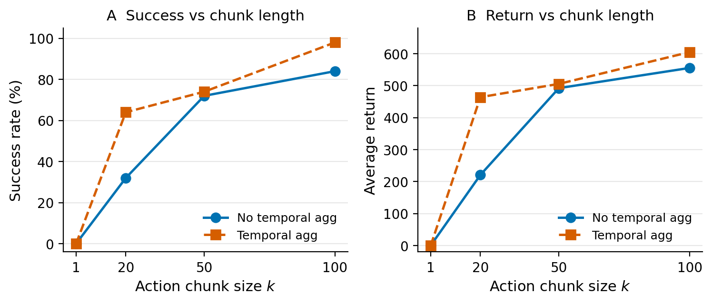
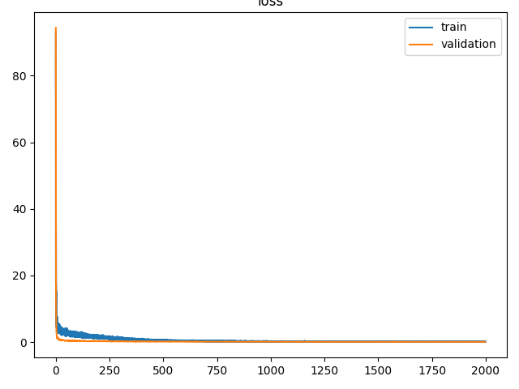

# Week 1 — ACT: Action Chunking with Transformers

Research note for VLA Roadmap Week 1. All numbers are taken from existing eval logs / CSVs under `ckpts/` (copies in [`results/`](results/)). No new training was run for this note.

**Detail docs:** [01 Paper](01_ACT_Paper.md) · [02 Architecture](02_ACT_Architecture.md) · [03 Code Map](03_ACT_Code_Map.md) · [04 Reproduction](04_Reproduction.md) · [05 Failure Analysis](05_Failure_Analysis.md) · [06 Chunk Ablation](06_Chunk_Size_Ablation.md) · [Source Index](results/SOURCE_INDEX.md)

---

## 1. Goal

- Understand Behavior Cloning (BC), Action Chunking, CVAE, and DETR-style Transformer policies.
- Reproduce ACT on simulated **Transfer Cube** (`sim_transfer_cube_scripted`).
- Analyze the remaining failure case (rollout 33) and test whether it is systematic.
- Run a controlled **chunk-size ablation** \(k \in \{1,20,50,100\}\).

---

## 2. Problem Formulation

**Single-step BC:**

\[
\pi(a_t \mid o_t)
\]

**ACT (action chunking):**

\[
\pi(a_{t:t+k-1} \mid I_t, q_t)
\]

| Symbol | Meaning (this repo) |
|---|---|
| \(I_t\) | visual observation (`top` camera) |
| \(q_t\) | proprioception (qpos), dim **14** |
| \(a\) | joint-space action, dim **14** |
| episode length | **400** steps |
| `DT` | **0.02** s |
| \(k\) | action chunk size (`num_queries`) |

\[
\text{prediction horizon} = k \times \mathrm{DT}
\]

---

## 3. Why Action Chunking

Paper motivation: compounding error, effective horizon reduction, temporal coherence for long-horizon bimanual manipulation.

**Evidence from this week (No Temporal Aggregation, same 50 eval poses):**

| \(k\) | Horizon | Success |
|---|---|---|
| 1 | 0.02 s | **0%** |
| 20 | 0.40 s | **32%** |
| 50 | 1.00 s | **72%** |
| 100 | 2.00 s | **84%** |

Longer chunks improve closed-loop Transfer Cube success under a controlled setup. See [06_Chunk_Size_Ablation.md](06_Chunk_Size_Ablation.md).



---

## 4. ACT Architecture

**Training**

```
expert actions + qpos
  → CVAE Transformer Encoder ([CLS], qpos, a_{t:t+k})
  → CLS → μ / logvar → z ∈ R^{32}

image → ResNet18 → features
qpos  → Linear projection
z     → Linear projection

  → Policy Transformer Encoder
  → k action queries (query_embed)
  → Transformer Decoder
  → action_head → [B, k, 14]
```

**Inference:** \(z = 0\) (zeros), no action encoder.  
**`num_queries = chunk_size = k`.**

Loss: \(\mathcal{L} = \mathrm{L1} + \lambda_{\mathrm{KL}}\,\mathrm{KL}\), with \(\lambda_{\mathrm{KL}}=10\).

Details and tensor shapes: [02_ACT_Architecture.md](02_ACT_Architecture.md).

---

## 5. Code Map

```
record_sim_episodes.py
  → episode_*.hdf5
  → utils.py (EpisodicDataset / pad / normalize)
  → DataLoader
  → imitate_episodes.py (train_bc / eval_bc)
  → ACTPolicy (policy.py)          # L1 + KL
  → DETRVAE (detr/models/detr_vae.py)
  → Transformer (detr/models/transformer.py)
  → action chunk [B, k, 14]
  → loss  |  closed-loop rollout
```

Full file/function map: [03_ACT_Code_Map.md](03_ACT_Code_Map.md).

---

## 6. Reproduction

Task: `sim_transfer_cube_scripted`. Main run: **\(k=100\)**, `batch_size=2` (official default is 8; 8GB VRAM forced batch 2). Checkpoint dir: `ckpts/transfer_cube/`.

| Setting | Success | Avg return |
|---|---|---|
| **No temporal aggregation** | **42/50 = 84%** | **555.2** (exact 555.24) |
| **Temporal aggregation** | **49/50 = 98%** | **604.8** (exact 604.76) |

**Temporal aggregation (TA)**

| Mode | Prediction horizon | Replanning / execution |
|---|---|---|
| No agg | \(k \times \mathrm{DT}\) | execute open-loop chunk of length \(k\) |
| With TA | \(k \times \mathrm{DT}\) | replan every \(\mathrm{DT}\); exponential average of overlapping predictions |

For \(k=100\): **2 s** prediction horizon, **20 ms** replanning with TA.

Training curves: [figures/transfer_cube_train_val_loss.png](figures/transfer_cube_train_val_loss.png). Full config: [04_Reproduction.md](04_Reproduction.md).

---

## 7. Failure Analysis

Under \(k=100\) + TA, the only failure among 50 random eval poses is **rollout 33**.

Approximate initial cube pose:

\[
x \approx 0.009,\quad y \approx 0.419
\]

(Exact: \(x=0.009017462464891502\), \(y=0.41886193238073793\), \(z=0.05\).)

| Experiment | Result |
|---|---|
| Original random eval (TA) | rollout 33 is the **only** failure (49/50) |
| Fixed that pose, re-run **10×** | **0/10** success, return 0 |
| Local 7×7 pose grid (**49** points) | **34** full success, **6** partial, **9** reward 0 |

Interpretation:

- Failure is **reproducible / systematic**, not a one-shot random error.
- Rollout 33 sits in a **lower-left weak-generalization region** of the training-time sampling box \(x\in[0,0.2]\), \(y\in[0.4,0.6]\) — i.e. **in-distribution / boundary-region generalization weakness**, not strict OOD.
- **Temporal robustness ≠ spatial / state-space generalization.**


Details: [05_Failure_Analysis.md](05_Failure_Analysis.md).

---

## 8. Chunk Size Ablation

**Controlled variables held fixed:** same dataset, train/val split (`set_seed(1)` before split), ACT architecture, `batch_size=2`, `hidden_dim=512`, `dim_feedforward=3200`, `kl_weight=10`, `lr=1e-5`, `epochs=2000`, `seed=0`, same 50 eval poses (`eval_bc` `set_seed(1000)`).

**Only main independent variable:** \(k \in \{1, 20, 50, 100\}\).

| \(k\) | Horizon | No TA Success | TA Success | No TA Return | TA Return |
|---|---|---|---|---|---|
| 1 | 0.02 s | 0% | 0% | 0.0 | 0.0 |
| 20 | 0.40 s | 32% | 64% | 220.8 | 463.9 |
| 50 | 1.00 s | 72% | 74% | 492.1 | 505.3 |
| 100 | 2.00 s | 84% | 98% | 555.2 | 604.8 |

(Exact returns: 463.86, 555.24, 604.76 — see [results/](results/).)

**Takeaways**

1. No-TA success vs \(k\): **0 → 32 → 72 → 84%**.
2. TA gain (percentage points): \(k=1\): **+0**; \(k=20\): **+32**; \(k=50\): **+2**; \(k=100\): **+14**. Interaction is **non-monotonic**.
3. \(k=1\) can reach low validation loss (~0.048) yet **0%** closed-loop success → **offline imitation loss ≠ closed-loop task performance**.
4. CVAE / latent-collapse story for \(k=1\) is a **possible hypothesis / plausible explanation**, not directly proven this week (no \(z\)-statistics ablation).



Full write-up: [06_Chunk_Size_Ablation.md](06_Chunk_Size_Ablation.md). Original Chinese report copy: [results/chunk_ablation_report.md](results/chunk_ablation_report.md).

---

## 9. Main Findings

1. **Action chunk length strongly affects** long-horizon manipulation performance (controlled \(k\) sweep).
2. **Longer chunks** reduce effective task horizon and improve temporal coordination (success rises with \(k\) under No TA).
3. **Prediction horizon** and **replanning horizon** are different concepts (No TA vs TA).
4. **Offline imitation loss is not sufficient** to judge robot policy quality (\(k=1\)).
5. **High average success can hide** systematic state-space failure regions (rollout 33 + local grid).

---

## 10. What ACT Leaves Unsolved

1. How to better model **multimodal** action distributions?
2. Is **CVAE** the best action generator for this setting?
3. Is **train-\(z\) / infer-\(z{=}0\)** mismatch ideal?
4. How to generate smoother, more robust action trajectories?
5. How to improve **state-space / spatial generalization**?

→ **Week 2 — Diffusion Policy**  
Central question: *Why use diffusion for robot action generation after ACT?*

---

## Artifact locations (do not move)

| Content | Path |
|---|---|
| \(k=100\) ckpts / eval | `ckpts/transfer_cube/` |
| \(k=1,20,50\) | `ckpts/chunk_ablation/k{1,20,50}/` |
| Failure analysis | `ckpts/transfer_cube/failure_analysis/`, `fixed_pose_eval/`, `failure_region/` |
| This note | `Week01_ACT/` |
